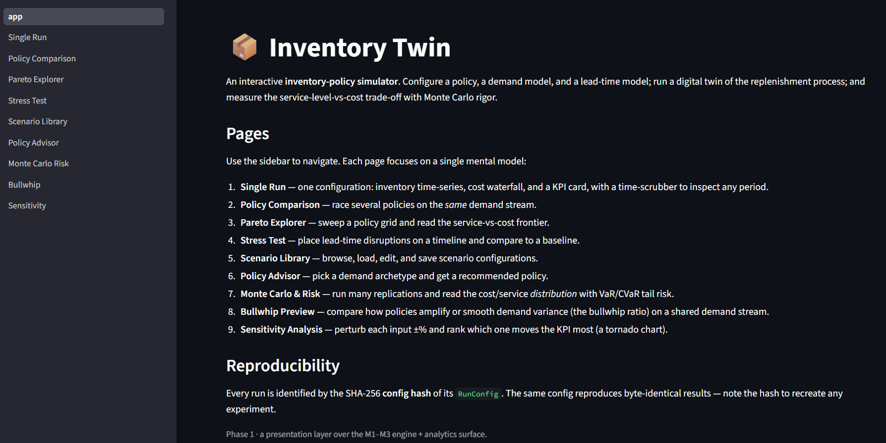
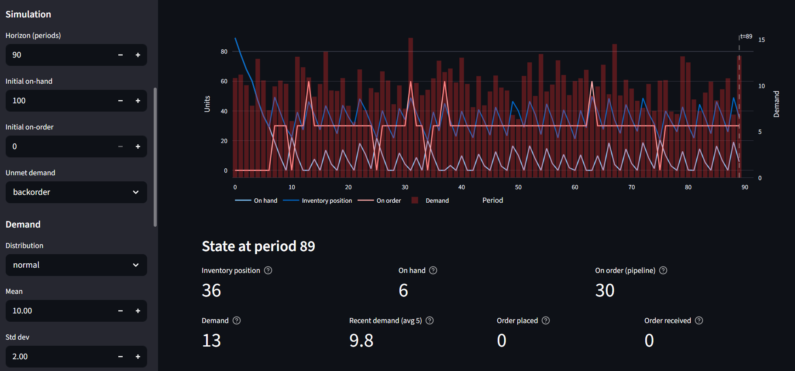
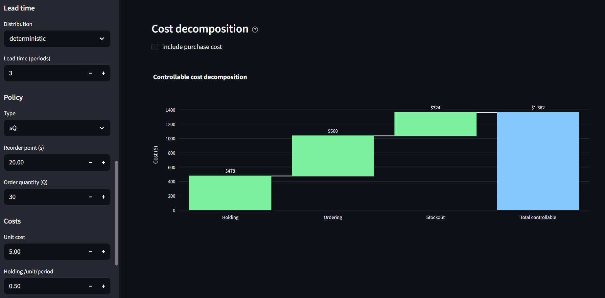
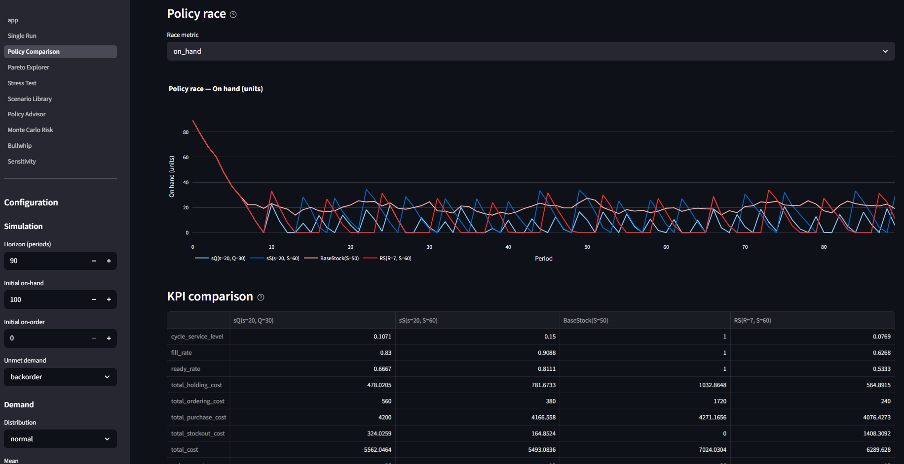
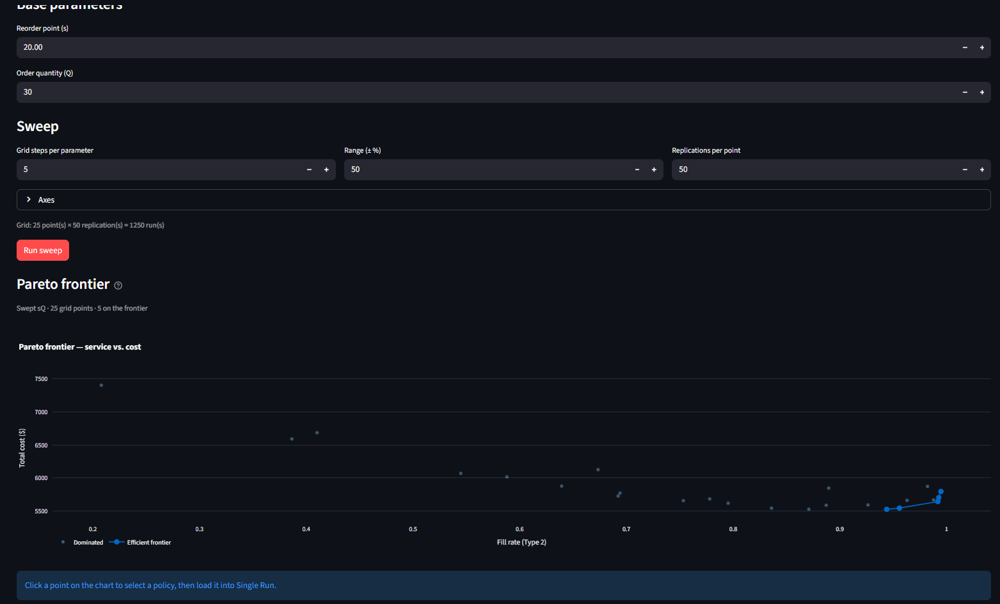
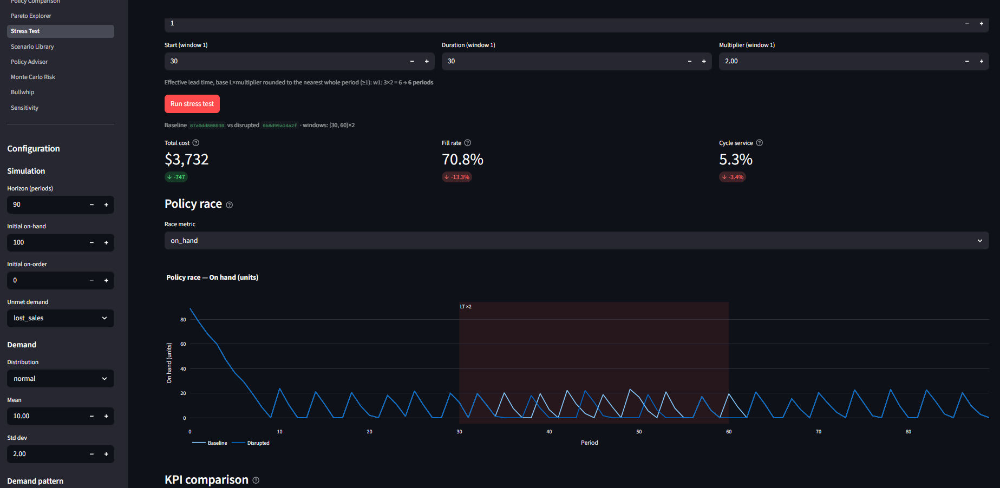
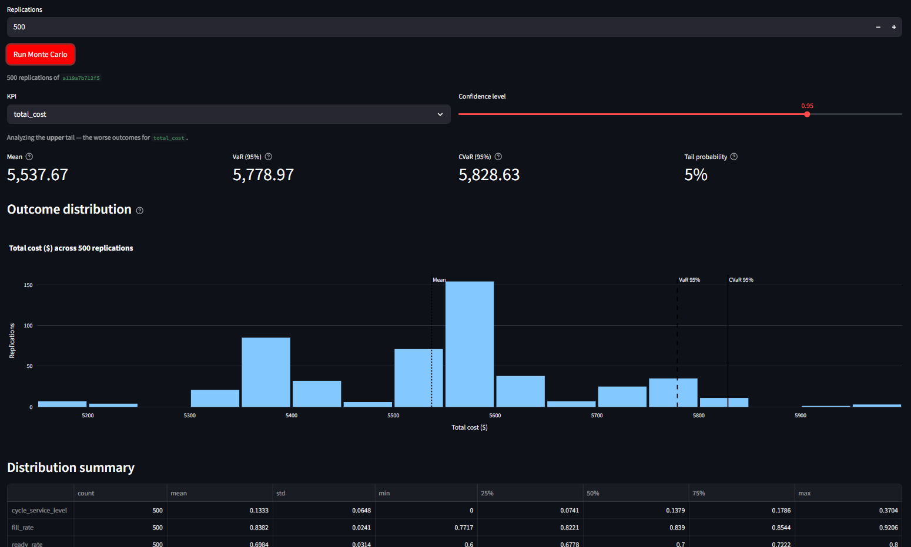
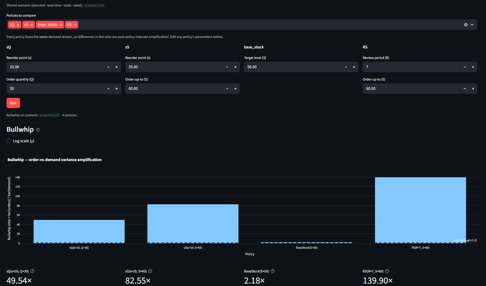
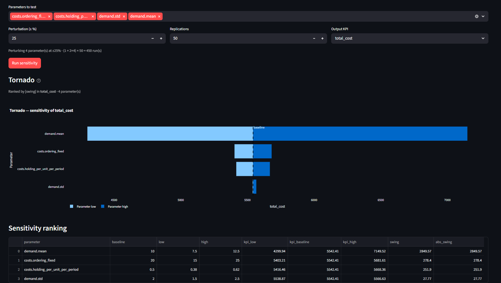

# 📦 Inventory Twin

[](https://github.com/mrkishore97/inventory-simulation-lab/actions/workflows/ci.yml)
[](LICENSE)


An interactive **inventory-policy simulator**. Configure a replenishment policy, a demand
model, and a lead-time model; run a digital twin of the replenishment process; and measure
the service-level-versus-cost trade-off with Monte Carlo rigor.



> **Live demo:** https://inventory-simulation-lab.streamlit.app
> **Walkthrough video:** coming soon.

---

## What it is

Inventory Twin is a single-echelon **digital twin** of an inventory replenishment process,
built as a teaching and exploration tool. It pairs a tested, fully deterministic compute
core with a thin Streamlit UI, so every number on screen comes from an independently tested
function rather than ad-hoc view logic. The same stable engine is built to carry the Phase 2
roadmap: a diagnostic layer that turns demand history into simulation-validated,
dollar-quantified recommendations, with a Gymnasium-compatible seam that keeps
reinforcement-learning research open as a parallel track.

## Features

A nine-page Streamlit app, each page built around a single decision:

- **Single Run** — simulate one configuration; inspect the inventory time-series, a
  cost-decomposition waterfall, and KPI cards, with a time-scrubber to replay any period.
- **Policy Comparison** — race several policies on the *same* demand stream and compare
  their cost and service trade-offs head-to-head.
- **Pareto Explorer** — sweep a policy's parameters and plot the cost-versus-service
  frontier; click a point to load that configuration.
- **Stress Test** — compose lead-time disruptions and view baseline-versus-disrupted
  behavior side by side, with the disruption windows shaded on the chart.
- **Scenario Library** — browse, edit, validate, run, and export scenario files.
- **Policy Advisor** — classify a demand history (Syntetos–Boylan) and get a recommended
  policy with a plain-English rationale.
- **Monte Carlo & Risk** — turn a single run into a distribution of outcomes and read
  Value-at-Risk and Conditional VaR off the cost tail.
- **Bullwhip** — measure order-variance amplification across policies.
- **Sensitivity** — perturb inputs one at a time and rank their impact with a tornado chart.

## Screenshots

**Single Run** — simulate one configuration; inspect the inventory time-series, the
cost-decomposition waterfall, and the KPI cards.




**Policy Comparison** — race several policies on the same demand stream.



**Pareto Explorer** — sweep a policy's parameters and read the cost-versus-service frontier.



**Stress Test** — baseline versus disrupted behavior, with the disruption windows shaded.



**Monte Carlo & Risk** — the outcome distribution with Value-at-Risk and Conditional VaR.



**Bullwhip** — order-variance amplification across policies.



**Sensitivity** — the one-at-a-time tornado ranking.



## Modelling surface

- **Policies:** (s, Q), (s, S), base-stock, and (R, S) — each validated against its
  classical closed-form.
- **Demand:** six distributions (Normal, Poisson, Negative Binomial, Gamma, Lognormal,
  Empirical) and five multiplicative patterns (stationary, seasonal, trending,
  intermittent, lumpy).
- **Lead time:** deterministic or stochastic (Normal, Gamma, Lognormal), plus scheduled
  lead-time disruptions.
- **Classical laws:** EOQ, safety stock, reorder point, and the newsvendor critical ratio —
  each twin-validated against the simulator.

See [`docs/theory.md`](docs/theory.md) for the full mathematics.

## Quickstart

Prerequisites: [uv](https://docs.astral.sh/uv/) and Python 3.11+.

```bash
# 1. Install dependencies into a managed virtualenv
uv sync

# 2. Launch the app
uv run streamlit run ui/app.py
```

Run a simulation headlessly from a scenario file:

```bash
uv run python -m inventory_twin.cli run --config data/scenarios/example.yaml
```

```
Run:        m1-baseline
Hash:       84d364adb32c
Horizon:    90 periods
Total cost: $5,562.05
Wrote ledger to: 84d364adb32c.csv
```

Run a seeded Monte Carlo distribution:

```bash
uv run python -m inventory_twin.cli montecarlo --config data/scenarios/example.yaml --reps 100 --jobs -1
```

Run the test suite:

```bash
uv run pytest
```

## Reproducibility

Every run is a pure function of its configuration: the same config and the same seed
produce a byte-identical result. Each configuration carries a `config_hash` that names both
the run and its output file — the bundled `example.yaml`, for instance, hashes to
`84d364adb32c`. See [`docs/reproducibility.md`](docs/reproducibility.md) for the full
determinism contract.

## Documentation

- [`docs/theory.md`](docs/theory.md) — the inventory science (policies, demand, costs, classical laws).
- [`docs/architecture.md`](docs/architecture.md) — the as-built system structure.
- [`docs/reproducibility.md`](docs/reproducibility.md) — the determinism and replay contract.
- [`docs/deploy.md`](docs/deploy.md) — deploying to Streamlit Community Cloud.
- [`LICENSE`](LICENSE) — MIT.

## Project layout

```
core/           the periodic simulation engine, config schema, seeding, Gym env
policies/       the four replenishment policies
demand/         demand distributions and patterns
leadtime/       lead-time models and disruptions
analytics/      KPIs, risk, bullwhip, Monte Carlo, Pareto, sensitivity
recommender/    the Syntetos–Boylan classifier and the heuristic policy advisor
experiments/    the rollout primitive and single-run drivers
visualization/  Streamlit-free Plotly chart and table factories
ui/             the Streamlit app (nine pages) — a thin presentation layer
inventory_twin/ the command-line entry point
docs/           theory, architecture, reproducibility
data/           example scenarios and demand archetypes
tests/          the test suite
```

## Data and licensing

The **source code** is released under the [MIT License](LICENSE) (© 2026 Kishore Kumar
Shanmugam). The bundled data has mixed provenance, and not all of it is MIT-licensed:

- **Project-authored (MIT):** the scenario files in `data/scenarios/*.yaml` and the
  synthetic fixture `data/m5/sample_smooth.parquet` (a Normal-shaped sample generated by
  `scripts/generate_m5_sample.py`).
- **Derived from Walmart M5 (not relicensed):** the demand archetypes
  `data/m5/archetype_*.parquet` and `data/m5/archetypes_manifest.json` are small,
  IID-resampled samples drawn from the [M5 Forecasting – Accuracy](https://www.kaggle.com/competitions/m5-forecasting-accuracy)
  dataset (Makridakis / Walmart, via Kaggle). They are included for demonstration only and
  remain subject to the original **M5 / Kaggle competition terms** — they are **not**
  relicensed under MIT.
- **Not redistributed:** the full raw M5 competition CSVs (`data/m5/raw/`) are not included
  in this repository. Download them from Kaggle under their terms to regenerate the
  archetypes via `scripts/extract_m5_archetypes.py`.

## Roadmap

Phase 2 builds a **diagnostic layer** on this same stable engine: ingest a company's demand
history, triage its data quality, generate and **simulation-validate** candidate policies on
that demand, and report the current-versus-recommended improvement in dollars. Reinforcement-
learning and multi-echelon control remain a parallel research track over the engine's
Gymnasium-compatible seam — a credibility exercise, not the headline.

## Acknowledgements

Demand archetypes are derived from the M5 Forecasting – Accuracy competition dataset
(Makridakis / Walmart), used under the Kaggle competition terms.
